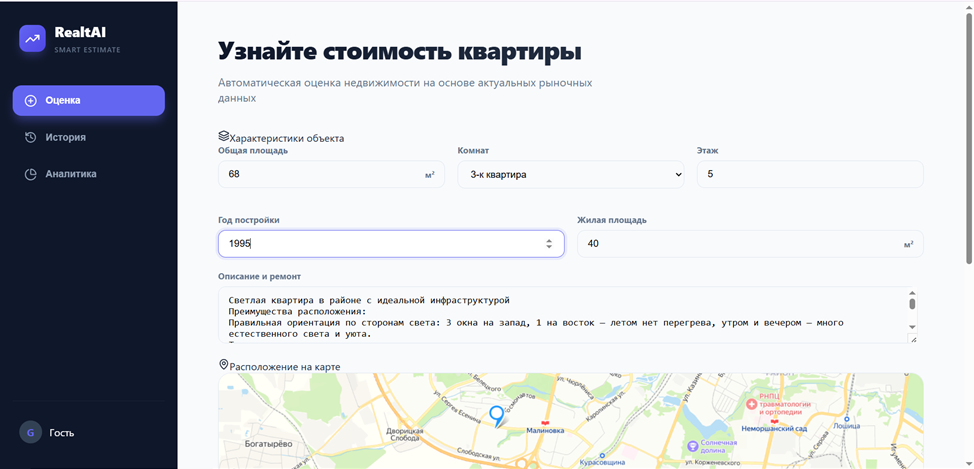
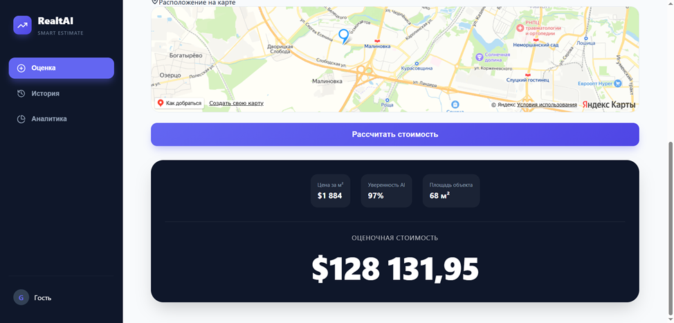
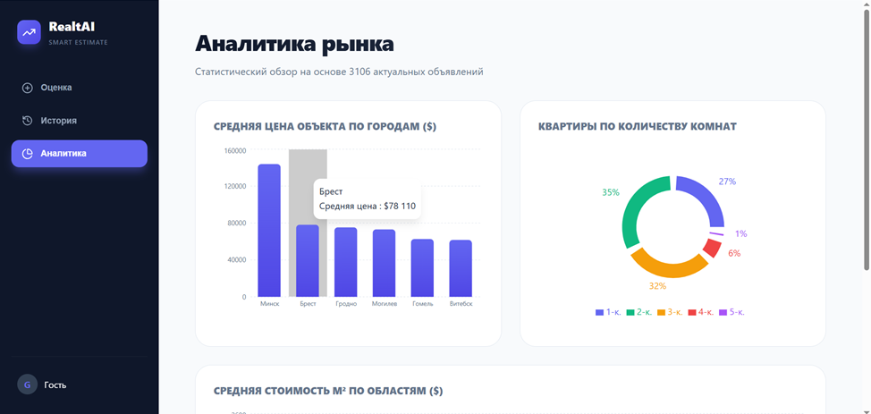
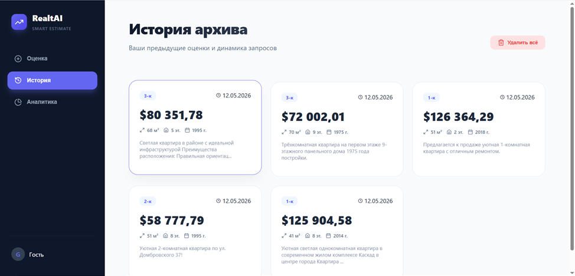

## Данные об авторе

# **Янулевич Виктория Станиславовна**  
**Логин:** Ynulevich_VS_22  
**Курс / семестр:** 4 курс / 8 семестр  
**Специальность:** «Искусственный интеллект»  
**Вид проекта:** Дипломная работа

# Realt Price Predictor 🏠💰

**Realt Price Predictor** — это интеллектуальный инструмент для оценки стоимости недвижимости на рынке Беларуси. Используя современные алгоритмы машинного обучения, сервис анализирует характеристики объекта (площадь, этажность, год постройки, локацию) и даже текстовое описание, чтобы выдать наиболее точную рыночную стоимость.

## 🚀 Основные возможности

*   **Оценка объекта:** Быстрый расчет стоимости квартиры с учетом более чем 20 параметров.
*   **Интерактивная карта:** Выбор точного местоположения объекта на Яндекс.Картах для учета географических факторов.
*   **NLP Анализ:** Автоматическое извлечение характеристик (ремонт, близость к метро, инфраструктура) из описания квартиры.
*   **Аналитика рынка:** Визуализация актуальных трендов: средние цены по городам, стоимость квадратного метра по областям и распределение объектов.
*   **История запросов:** Сохранение результатов ваших предыдущих оценок локально.

---

## 📸 Скриншоты

### 1. Страница оценки (Evaluation)


*Интерфейс ввода параметров и результат предсказания*

### 2. Аналитика рынка (Analytics)

*Визуализация средних цен и статистики по регионам*

### 3. История запросов (History)

*Список предыдущих расчетов, сохраненный локально*

---

## 🛠 Технологический стек

### Бэкенд (Backend)
*   **Язык:** Python 3.x
*   **Фреймворк:** [FastAPI](https://fastapi.tiangolo.com/)
*   **ML Библиотеки:** Scikit-learn, LightGBM, XGBoost, CatBoost, Pandas, NumPy
*   **Модели:** Предварительно обученная модель (`best_model.pkl`) и Geo-кластеризация (KMeans).

### Фронтенд (Frontend)
*   **Фреймворк:** React + TypeScript
*   **Сборщик:** Vite
*   **Карты:** Яндекс.Карты (@pbe/react-yandex-maps)
*   **Графики:** [Recharts](https://recharts.org/)
*   **Иконки:** Lucide React

---

## ⚙️ Установка и запуск

### 1. Подготовка бэкенда
```bash
# Перейдите в директорию бэкенда
cd backend

# Создайте виртуальное окружение
python -m venv venv

# Активируйте его
# Для Windows:
.\venv\Scripts\activate
# Для Linux/Mac:
source venv/bin/activate

# Установите зависимости
pip install -r requirements.txt
```

### 2. Подготовка фронтенда
```bash
# Перейдите в директорию фронтенда
cd frontend

# Установите зависимости
npm install

# Запустите проект
npm run dev
```

### 3. Запуск API
```bash
# Находясь в папке backend (с активированным venv)
uvicorn main:app --reload
```
*   **Фронтенд:** [http://localhost:3000](http://localhost:3000)
*   **Бэкенд (API):** [http://localhost:8000](http://localhost:8000)

---

## 📁 Структура проекта

*   `backend/` — Серверная часть на FastAPI и логика обработки данных.
    *   `requirements.txt` — Зависимости только для работы API и модели.
*   `frontend/` — Клиентская часть на React.
*   `assets/` — Скриншоты и медиа-файлы проекта.
*   `requirements-dev.txt` — Полный список зависимостей для разработки (парсинг, обучение).
*   `best_model.pkl` — Сохраненная обученная модель машинного обучения.
*   `flats_realtby.xlsx` — Набор данных для обучения и аналитики.
*   `data_scraping_pipeline.ipynb` — Скрипт для автоматического сбора данных (парсинг) с realt.by.
*   `training_pipeline.ipynb` — Процесс предобработки данных и обучения ML-модели.

---

## 📝 Примечание
Для корректной работы аналитики и предсказаний убедитесь, что файлы `best_model.pkl` и `flats_realtby.xlsx` находятся в корневой директории проекта.
